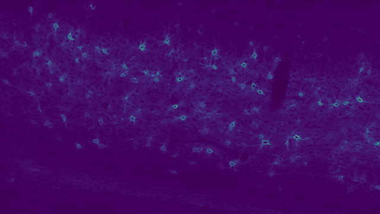

# Counting Perineuronal Nets



PyTorch code for training and evaluating cell counting and localization methodologies.
We provide pretrained models for counting **perineuronal nets (PNN)** and **parvalbumin cells (PV)** in fluorescence microscopy images.

## Papers
  - Ciampi, Luca, et al. "[Learning to count biological structures with raters’ uncertainty.](https://www.sciencedirect.com/science/article/abs/pii/S1361841522001475)" Medical Image Analysis 80 (2022): 102500.
  - Lupori, Leonardo, et al. "[A Comprehensive Atlas of Perineuronal Net Distribution and Colocalization with Parvalbumin in the Adult Mouse Brain.](https://www.biorxiv.org/content/biorxiv/early/2023/01/25/2023.01.24.525313.full.pdf)" bioRxiv (2023): 2023-01.


## Getting Started

You'll need:
- Python >= 3.8
- torch 1.7.1 (torchvision 0.8.2)
- other packages in requirements.txt

We provide a [`Dockerfile`](Dockerfile) to build the environment.

## Trained models

We provide Localization and Scoring models for PNNs and PVs structures:

|              	| Latest (v0.5) 	| v0.3 	|
|--------------	|:-------------:	|:----:	|
| PNN Localization 	| [FRCNN-640](https://github.com/ciampluca/counting_perineuronal_nets/releases/download/v0.5/pnn_v2_fasterrcnn_640.zip) | [FRCNN-640](https://github.com/ciampluca/counting_perineuronal_nets/releases/download/v0.3/pnn_fasterrcnn_640.zip) \| [UNet-320](https://github.com/ciampluca/counting_perineuronal_nets/releases/download/v0.3/pnn_unet_320.zip) |
| PNN Scoring  	| [OR](https://github.com/ciampluca/counting_perineuronal_nets/releases/download/v0.5/pnn_v2_scoring_ordinal_regression.zip) \| [RL](https://github.com/ciampluca/counting_perineuronal_nets/releases/download/v0.5/pnn_v2_scoring_rank_learning.zip) | [AC](https://github.com/ciampluca/counting_perineuronal_nets/releases/download/v0.3/pnn_scoring_classification.zip) \| [OR](https://github.com/ciampluca/counting_perineuronal_nets/releases/download/v0.3/pnn_scoring_ordinal_regression.zip) \| [RL](https://github.com/ciampluca/counting_perineuronal_nets/releases/download/v0.3/pnn_scoring_rank_learning.zip) |
| PV Localization 	| [FRCNN-640](https://github.com/ciampluca/counting_perineuronal_nets/releases/download/v0.5/pv_v2_fasterrcnn_640.zip)   | - |
| PV Scoring  	| [OR](https://github.com/ciampluca/counting_perineuronal_nets/releases/download/v0.5/pv_v2_scoring_ordinal_regression.zip) \| [RL](https://github.com/ciampluca/counting_perineuronal_nets/releases/download/v0.5/pv_v2_scoring_rank_learning.zip)| - |


| :exclamation:  Ensure you have checked out the correct code version (`v0.5` or `v0.3`) for the model you want to use. |
|-----------------------------------------|

## How to do predictions

Download and unzip a localization and a scoring model. Alternatively, you can train your own models (see next section).
Then, you can do predictions using the `predict.py` script by passing the extracted run folders and the paths to data to process. E.g.:

```bash
# use both localization and scoring models (tip: set a low localization threshold for high-recall localization)
python predict.py pnn_v2_fasterrcnn_640/ -r pnn_v2_scoring_rank_learning/ -t 0.0 my_images_*.tiff

# use only the localization model (uses default threshold)
python predict.py pnn_v2_fasterrcnn_640/ my_images_*.tiff

# check python predict.py -h for more options
```

Accepted formats for input data are image formats (TIFF, PNG, JPEG, etc.) and the HDF5 format. We assume a sigle 1-channel (bidimensional) image per input file. For HDF5, we assume the image is stored in the `/data` dataset.

## How to train

First, you need to download the datasets in the `data/` folder (see [these instructions](data/)). Then you can use the `train.py` and `train_score.py` script to launch training sessions.

### Stage 1: Localization Model Training

Train configurations for localization models are specified with [Hydra](https://hydra.cc/) config groups in `conf/experiments`. You can run a training experiment by passing as argument `experiment=<exp_name>` to the `train.py` script, where `<exp_name>` is the path to a YAML experiment configuration relative to `conf/experiments` and without the `.yaml` extension.

#### Examples:

- Train the detection-based approach (FasterRCNN) with 480x480 patches on PerineuronalNets:
  ```bash
  python train.py experiment=perineuronal-nets/detection/fasterrcnn_480
  ```

- Train the density-based approach (CSRNet) on VGG Cells:
  ```bash
  python train.py experiment=vgg-cells/density/csrnet
  ```

Runs files will be produced in the `runs` folder. Once trained, you can evaluate the trained models on the corresponding test sets using the `evaluate.py` script.
E.g.,
```bash
# check python evaluate.py -h for more options
python evaluate.py runs/experiment=perineuronal-nets/detection/fasterrcnn_480/
```
Metrics and predictions will be saved in the run folder under `test_predictions/`.

### Stage 2: Scoring Model Training

Train configurations for scoring models are specified in `conf_score/`. You can run a training experiment by passing as argument `method=<method_name>` to the `train_score.py` script, where `<method_name>` is the path to a YAML configuration relative to `conf_score/method` and without the `.yaml` extension (e.g., `ordinal_regression`).

Scoring models can be trained only on the Perineuronal Nets dataset that contains multi-rater data.

#### Examples:

  ```bash
  # train scorer with Agreement Ordinal Regression method
  python train_score.py method=ordinal_regression seed=87

  # train scorer with Agreement Rank Learning method
  python train_score.py method=pairwise_balanced seed=67
  ```

Runs files will be produced in the `runs_score` folder. Once trained, you can evaluate the trained models on the corresponding test sets using the `evaluate_score.py` script.
E.g.,
```bash
# check python evaluate_score.py -h for more options
python evaluate_score.py runs_score/method=pairwise_balanced,seed=67/
```
Metrics and predictions will be saved in the run folder under `test_predictions/`.


## Reproducing Experiments

- Check the [`reproduce.sh`](./reproduce.sh) script for launching all training and evaluation phases defined in the paper.

- Check the [`show.ipynb`](./show.ipynb) notebook for producing figures and tables presented in the paper.
